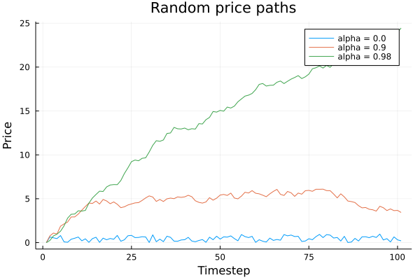
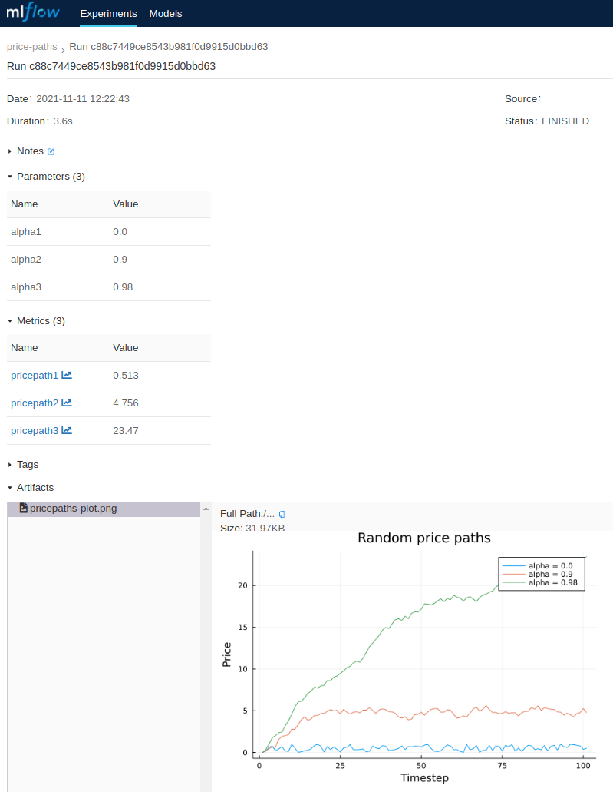
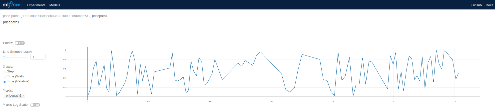

# Tutorial

For a more comprehensive `MLFlow` tutorial, refer to its [documentation](https://mlflow.org/docs/latest/tutorials-and-examples/tutorial.html).

This tutorial assumes that you are familiar with `MLFlow` concepts and focuses on usage of `MLFlowClient`.


Suppose that you are developing a method `getpricepath(α, n)` which generates a random price path using `α`. This example is adapted from [QuantEcon Chapter 1](https://julia.quantecon.org/getting_started_julia/julia_by_example.html#id7).


```julia
using Plots
using Random

αs = [0.0, 0.9, 0.98]
n = 100
p = plot()

function getpricepath(α, n)
    x = zeros(n + 1)
    x[1] = 0.0
    for t in 1:n
        x[t+1] = α * x[t] + rand()
    end
    x
end

pricepaths = [getpricepath(α, n) for α in αs]

for (idx, pricepath) in enumerate(pricepaths)
    plot!(p, pricepath,
        title="Random price paths",
        label="alpha = $(αs[idx])",
        xlabel="Timestep", ylabel="Price"
    )
end

p
```

This could result in the following plot:



Now, suppose that you are interested in turning this into an experiment which stores its metadata and results in MLFlow using `MLFlowClient`. You could amend the code like this:

!!! note
    Running this example assumes you have an active MLFlow running on your computer.


```julia
using Plots
using MLFlowClient
using Random

# Parameters
αs = [0.0, 0.9, 0.98]
n = 100

"Method that generates price paths of length `n` based on `α`"
function getpricepath(α, n)
    x = zeros(n + 1)
    x[1] = 0.0
    for t in 1:n
        x[t+1] = α * x[t] + rand()
    end
    x
end
p = plot()

# Create MLFlow instance
mlf = MLFlow("http://localhost:5000/api")

# Initiate new experiment
experiment_id = createexperiment(mlf; name="price-paths")

# Create a run in the new experiment
exprun = createrun(mlf, experiment_id)

# Log parameters and their values
for (idx, α) in enumerate(αs)
    logparam(mlf, exprun, "alpha$(idx)", string(α)) # MLFlow only supports string parameter values
end

# Obtain pricepaths
pricepaths = [getpricepath(α, n) for α in αs]

# Log pricepaths in MLFlow
for (idx, pricepath) in enumerate(pricepaths)
    plot!(p,
        pricepath,
        title="Random price paths",
        label="alpha = $(αs[idx])",
        xlabel="Timestep",
        ylabel="Price"
    )

    logmetric(mlf, exprun, "pricepath$(idx)", pricepath)
end

# Save the price path plot as an image
plotfilename = "pricepaths-plot.png"
png(plotfilename)

# Upload the plot as an artifact associated with the MLFlow experiment's run
logartifact(mlf, exprun, plotfilename)

# remote temporary plot which was already uploaded in MLFlow
rm(plotfilename)

# complete the experiment
updaterun(mlf, exprun, "FINISHED")
```

This will result in the folowing experiment created in your `MLFlow` which is running on `http://localhost/`:



You can also observe series logged against individual metrics, i.e. `pricepath1` looks like this in `MLFlow`:


